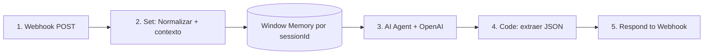

# Agente n8n — Gestión de Ofertas

Edita **estatus/campos de gestión** de la oferta abierta. Devuelve intent `ACTUALIZAR_OFERTA`; el frontend (`OfertaAgentePanel`) ejecuta `updateOffer` → **cambio real**.

- **Webhook:** `POST /ofertas-gestion` → `…/webhook-test/ofertas-gestion` (prueba; en prod usa `/webhook/ofertas-gestion`)
- **Usado por:** detalle de oferta (panel del agente)
- **Contexto recibido:** `{ idOferta, etapa, tipoOferta }`

## Flujo de nodos



### 1. Webhook
- Method `POST` · Path `ofertas-gestion` · Respond via nodo Respond
- Body: `{ mensaje, sessionId, idOferta, etapa, tipoOferta }`

### 2. Set / Edit Fields — "Normalizar"
| Campo | Valor |
|-------|-------|
| `pregunta` | `{{ $json.body?.mensaje ?? $json.mensaje ?? '' }}` |
| `sessionId` | `{{ $json.body?.sessionId ?? 'anon' }}` |
| `idOferta` | `{{ $json.body?.idOferta ?? '' }}` |
| `tipoOferta` | `{{ $json.body?.tipoOferta ?? 'Cliente' }}` |
| `etapaActual` | `{{ $json.body?.etapa ?? '' }}` |

### 3. AI Agent (OpenAI)
- Chat Model: **OpenAI** `gpt-5.1-mini` · temperature **0**
- Memory: **Window Buffer Memory**, key `{{ $json.sessionId }}`, ventana 6
- User message: `Solicitud: {{ $json.pregunta }}\nContexto: oferta {{ $json.idOferta }}, tipo {{ $json.tipoOferta }}, etapa actual {{ $json.etapaActual }}`
- System message: (pegar)

```
Eres un asistente de GESTIÓN de ofertas de un CRM bancario. Interpretas la solicitud del
ejecutivo sobre la oferta ABIERTA y devuelves un intent para actualizarla. NO ejecutas nada.

Responde EXCLUSIVAMENTE con JSON válido (sin ```):
{
  "intent": "ACTUALIZAR_OFERTA",
  "data": { "campo": "etapa|monto|producto|motivo", "valor": "<valor>" },
  "mensaje": "confirmación breve"
}

VALORES PERMITIDOS:
- etapa (tipoOferta = Cliente): No contactado, Interesado, Negociación, Descartado, Fabrica, Entregado, Timbrado
- etapa (tipoOferta = Prospecto): No contactado, En negociación, Interesado, Descartado, Convertido
- monto: número > 0 (sin símbolos)
- producto: nombre del producto
- motivo: motivo de descarte (texto, >= 20 caracteres)

REGLAS:
- Usa el "campo" correcto y el "valor" normalizado a los valores permitidos según tipoOferta.
- Si piden DESCARTAR, intent ACTUALIZAR_OFERTA con campo "etapa", valor "Descartado"; pide
  el motivo (>=20 caracteres) en "mensaje" si no lo dieron.
- Si el valor no es válido (p.ej. etapa inexistente), explícalo en "mensaje" y NO inventes.
- Solo JSON.

EJEMPLOS:
"pásala a negociación"  -> { "intent":"ACTUALIZAR_OFERTA","data":{"campo":"etapa","valor":"Negociación"},"mensaje":"Etapa actualizada a Negociación." }
"sube el monto a 75000" -> { "intent":"ACTUALIZAR_OFERTA","data":{"campo":"monto","valor":"75000"},"mensaje":"Monto actualizado a $75,000." }
"descártala, el cliente ya no tiene interés por ahora" -> { "intent":"ACTUALIZAR_OFERTA","data":{"campo":"etapa","valor":"Descartado","motivo":"El cliente ya no tiene interés por ahora"},"mensaje":"Oferta descartada." }
```

### 4. Code — "Extraer JSON"
```javascript
const raw = $input.first().json;
let t = raw.output ?? raw.text ?? raw.response ?? JSON.stringify(raw);
const f = String(t).match(/```(?:json)?\s*([\s\S]*?)\s*```/i); if (f) t = f[1];
let plan; try { plan = JSON.parse(t); } catch { plan = { mensaje: String(t) }; }
return [{ json: plan }];
```

### 5. Respond to Webhook
- Respond With **JSON** · Body `{{ $json }}`

## Ejecución en el frontend
`OfertaAgentePanel`: `updateOffer(idOferta, mapGestionChanges(data))`. `mapGestionChanges` traduce `campo/valor` a columnas (`Etapa`, `Monto de la oferta`, `Producto`, `Motivo de descarte`). El store revalida (monto>0, motivo≥20 al descartar) y actualiza el registro **real**.

## Referencias
- [[Agentes-Gestion]] · [[Agente-Crear-Ofertas]]
- `src/components/ofertas/OfertaAgentePanel.tsx`, `asistente.ts` (`mapGestionChanges`)
