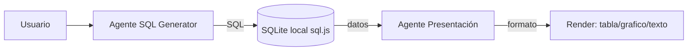

# Agentes n8n — Visión General

Instancia n8n: `https://abrahamnavarrete.app.n8n.cloud`

El sistema usa **5 webhooks/agentes** independientes, organizados en dos arquitecturas:

## Arquitectura Dual-Agent (Chat de Datos)



| Agente | Webhook | Nota |
|--------|---------|------|
| SQL Generator | `/regio-ia-assistant` | [[Agente-SQL-Generator]] |
| Presentación | `/presenter` | [[Agente-Presentacion]] |

## Agentes Independientes

| Agente | Webhook | Nota |
|--------|---------|------|
| Procedimientos | `/procedimientos` | [[Agente-Procedimientos]] |
| Prospectos | `/prospect` | [[Agente-Prospectos-Oportunidades]] |
| Oportunidades | `/Register` | [[Agente-Prospectos-Oportunidades]] |

## Modos del Chat

El [[tecnico/Chat]] tiene dos modos (`chatMode` en [[tecnico/Stores#chat-store]]):

- **`datos`** → arquitectura dual-agent (SQL + Presentación) sobre [[tecnico/Base-de-Datos-SQL]]
- **`procedimientos`** → [[Agente-Procedimientos]]

> [!note]
> `webhook.service.ts` y `API_CONFIG` (`/webhook/agent-crm`) son legacy y no los usa el chat actual. Ver [[tecnico/Servicios]].

## Patrón común de parseo de respuestas

Todos los agentes pueden devolver: objeto directo, array `[{...}]`, o `{ output: "```json...```" }`. Los servicios extraen JSON de bloques markdown y hacen fallback buscando `{...}`. Ver [[tecnico/Servicios]].

## Reglas de Privacidad

Las respuestas de datos pasan por filtros PII antes de mostrarse en tablas. Ver [[negocio/Privacidad-Datos]].
