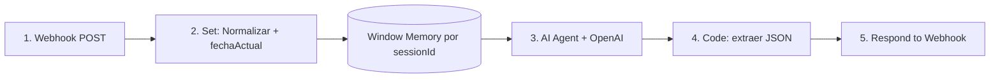

# Agente n8n — Tareas / Agenda

Crea **tareas** y **reuniones** por lenguaje natural. Devuelve intent; el frontend (`AsistenteTareasPanel`) ejecuta `agregarEvento` → **cambio real** en la agenda.

- **Webhook:** `POST /tareas` → `https://abrahamnavarrete.app.n8n.cloud/webhook/tareas`
- **Usado por:** módulo Tareas (panel del asistente)
- **Contexto recibido:** `{ fechaActual }` (YYYY-MM-DD, para resolver "hoy/mañana")

## Flujo de nodos



### 1. Webhook
- Method `POST` · Path `tareas` · Respond via nodo Respond
- Body: `{ mensaje, sessionId, fechaActual }`

### 2. Set / Edit Fields — "Normalizar"
| Campo | Valor |
|-------|-------|
| `pregunta` | `{{ $json.body?.mensaje ?? $json.mensaje ?? '' }}` |
| `sessionId` | `{{ $json.body?.sessionId ?? 'anon' }}` |
| `fechaActual` | `{{ $json.body?.fechaActual ?? $now.format('yyyy-MM-dd') }}` |

### 3. AI Agent (OpenAI)
- Chat Model: **OpenAI** `gpt-5.1-mini` · temperature **0**
- Memory: **Window Buffer Memory**, key `{{ $json.sessionId }}`, ventana 6 (slot-filling multi-turno)
- User message: `Solicitud: {{ $json.pregunta }}\nHoy es {{ $json.fechaActual }}`
- System message: (pegar)

```
Eres un asistente de AGENDA. Conviertes la solicitud en un intent para crear una tarea o
reunión. NO ejecutas nada: solo devuelves JSON.

Responde EXCLUSIVAMENTE con JSON válido (sin ```):
{
  "intent": "CREAR_TAREA" | "CREAR_REUNION",
  "data": { "nombre": "", "fecha": "YYYY-MM-DD", "hora": "HH:MM", "duracion": 60 },
  "mensaje": "confirmación breve"
}

REGLAS:
- Resuelve la fecha a formato YYYY-MM-DD usando "Hoy es <fechaActual>": interpreta hoy,
  mañana, pasado mañana y días de la semana (el próximo).
- "hora" (HH:MM 24h) SOLO para reuniones. Para tareas puede omitirse.
- "duracion" en minutos (number). Si no la dan: reunión 60, tarea 30.
- Si falta el nombre o la fecha, pídelo en "mensaje" y deja el campo vacío.
- Solo JSON.

EJEMPLOS (si Hoy es 2026-06-03):
"reunión con el cliente mañana a las 10 por 45 min"
{ "intent":"CREAR_REUNION","data":{"nombre":"Reunión con el cliente","fecha":"2026-06-04","hora":"10:00","duracion":45},"mensaje":"Reunión agendada para mañana 10:00." }

"recuérdame llamar a soporte el lunes"
{ "intent":"CREAR_TAREA","data":{"nombre":"Llamar a soporte","fecha":"2026-06-08","duracion":30},"mensaje":"Tarea creada para el lunes." }
```

### 4. Code — "Extraer JSON"
```javascript
const raw = $input.first().json;
let t = raw.output ?? raw.text ?? raw.response ?? JSON.stringify(raw);
const f = String(t).match(/```(?:json)?\s*([\s\S]*?)\s*```/i); if (f) t = f[1];
let plan; try { plan = JSON.parse(t); } catch { plan = { mensaje: String(t) }; }
return [{ json: plan }];
```

### 5. Respond to Webhook
- Respond With **JSON** · Body `{{ $json }}`

## Ejecución en el frontend
`AsistenteTareasPanel`: con intent `CREAR_TAREA`/`CREAR_REUNION` llama `agregarEvento({ tipo, nombre, fecha, hora, duracion, esPlaneada:false })` y refresca la vista. El asistente local sigue resolviendo el alta guiada por pasos sin n8n.

## Referencias
- [[Agentes-Gestion]] · [[../negocio/Tareas]]
- `src/components/tareas/AsistenteTareasPanel.tsx`
