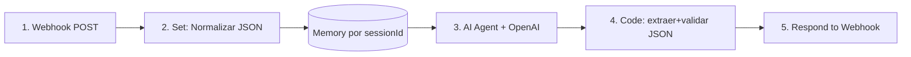

# Flujo n8n — Cerebro de Datos

Diseño del workflow del webhook `/AgentCRMKPI`. El agente OpenAI hace **una sola pasada** que devuelve **SQL libre (cruzas entre tablas) + la presentación elegida**. El SQL se ejecuta en el **frontend** (sql.js), no en n8n → 0 filas viajan al LLM.

> [!important] Principio
> n8n es solo el **cerebro** (decide qué consultar y cómo mostrarlo). El frontend es las **manos** (ejecuta SQL local, aplica privacidad, renderiza). El LLM nunca ve los datos crudos.

## Diagrama del flujo



## Nodos

### 1. Webhook
- Método: `POST` · Path: `AgentCRMKPI`
- Response Mode: **Using 'Respond to Webhook' node**
- Recibe: `{ chatInput, sessionId, timestamp }`

### 2. Set / Edit Fields — "Normalizar entrada"
Homogeneiza el JSON sin importar el origen:

| Campo | Valor (expresión) |
|-------|-------------------|
| `pregunta` | `{{ $json.body.chatInput || $json.body.mensaje || $json.body.pregunta }}` |
| `sessionId` | `{{ $json.body.sessionId || $json.body.conversationId || 'anon' }}` |
| `fecha` | `{{ $json.body.timestamp || $now }}` |

### 3. AI Agent (OpenAI)
- Chat Model: **OpenAI Chat Model** — `gpt-5.1-mini` · **temperature 0**
- Memory: **Window Buffer Memory**, key = `{{ $json.sessionId }}`, ventana 6-10 mensajes (da contexto multi-turno: "ahora agrúpalo por estado").
- User message: `{{ $json.pregunta }}`
- System message: ver [[Pre-Prompt-Cerebro]] (esquema completo + contrato `{sql, presentacion}` con `kpis`/`insight`).
- Configuración detallada paso a paso: [[Configuracion-Nodo-n8n]].

### 4. Code — "Extraer y validar JSON"
Limpia el markdown, parsea y valida que sea solo lectura:

```javascript
const raw = $input.first().json;
let texto = raw.output ?? raw.text ?? raw.response ?? '';
if (typeof texto !== 'string') texto = JSON.stringify(texto);

// Extraer JSON de un bloque ```json o entre llaves
const fence = texto.match(/```(?:json)?\s*([\s\S]*?)\s*```/i);
if (fence) texto = fence[1];
else {
  const a = texto.indexOf('{'), b = texto.lastIndexOf('}');
  if (a !== -1 && b > a) texto = texto.slice(a, b + 1);
}

let plan;
try { plan = JSON.parse(texto); }
catch (e) { return [{ json: { error: 'JSON inválido del agente', raw: texto } }]; }

// Seguridad: solo SELECT/WITH (defensa extra; el frontend revalida)
if (plan.sql) {
  const s = plan.sql.trim().toUpperCase();
  const prohibidas = ['INSERT','UPDATE','DELETE','DROP','CREATE','ALTER','TRUNCATE','EXEC'];
  if (prohibidas.some(p => s.startsWith(p)) || !(s.startsWith('SELECT') || s.startsWith('WITH'))) {
    return [{ json: { error: 'Solo se permiten consultas SELECT' } }];
  }
}

// Normalizar presentación (si falta, el frontend usa heurística local)
plan.presentacion = plan.presentacion || null;
return [{ json: plan }];
```

### 5. Respond to Webhook
- Respond With: **JSON** · Body: `{{ $json }}`

## Contrato de salida

```json
{
  "sql": "SELECT c.ide, SUM(v.montoMovimiento) AS total FROM clientes c JOIN variacionescheques v ON v.ide = c.ide WHERE c.ide NOT IN (SELECT ide FROM tdc WHERE fechaBaja IS NULL) GROUP BY c.ide ORDER BY total DESC LIMIT 10",
  "tipo_consulta": "cruce",
  "presentacion": { "formato": "tabla", "titulo": "Top 10 clientes con variaciones sin TDC", "ejeX": "ide", "ejeY": "total" },
  "explicacion": "Cruce de clientes con variaciones excluyendo los que tienen TDC activa"
}
```

El frontend ([[../tecnico/Servicios#aiassistantservice]]): ejecuta el SQL local → aplica [[../negocio/Privacidad-Datos|privacidad]] → renderiza con `presentacion`. Si `presentacion` es null, usa `decidirPresentacionLocal`.

## Flujo opcional: Conclusiones / Insights

Para "analiza y dame conclusiones": tras ejecutar, el frontend envía a un webhook `/insights` **solo un resumen agregado** (totales, top 5, no filas crudas) y el agente devuelve la narrativa. Mantiene el costo bajo.

## Referencias

- [[Pre-Prompt-Cerebro]] — system prompt
- [[../tecnico/Servicios#aiassistantservice]]
- [[../tecnico/Base-de-Datos-SQL]]
- [[Agente-Presentacion]] — ahora opcional
