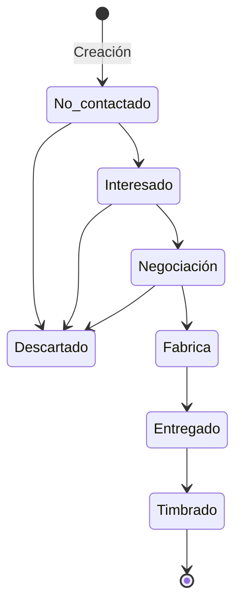

# Oportunidades

## Definición

Registro de una oferta comercial activa para un cliente existente. Representa una venta en proceso de un producto bancario/financiero.

## Ciclo de Vida

**Etapas válidas:** `No contactado`, `Interesado`, `Negociación`, `Descartado`, `Fabrica`, `Entregado`, `Timbrado`

## Productos Disponibles

| Familia | Productos |
|---------|-----------|
| TDC | Tarjeta Clasica, Tarjeta Gold, Tarjeta Empresarial |
| TPV | TPV Básico, TPV Plus, TPV Premium |
| Cheques | NominaFlex, NominaTradicional, NominaBasica |

## Campos Clave

- `idOferta`: Identificador único (formato `OC...`)
- `cliente`: Nombre del cliente
- `rfc` / `ide`: Identificadores del cliente
- `producto`: Producto específico
- `familia`: TDC | TPV | Cheques
- `monto`: Monto de la oferta (> 0)
- `etapa`: Estado actual

## Reglas de Negocio

1. El monto debe ser mayor a 0 si se especifica.
2. El producto debe pertenecer a una familia válida.
3. Las etapas siguen el flujo definido (no se puede saltar de `No contactado` a `Timbrado`).
4. RFC e IDE tienen prioridad sobre el nombre para identificar al cliente.

## Referencias

- [[Clientes]] — Entidad cliente relacionada
- [[agentes-n8n/Agente-Principal]] — Agente que gestiona intents de oportunidades
- [[tecnico/Componentes#oportunidades]] — Componentes UI
