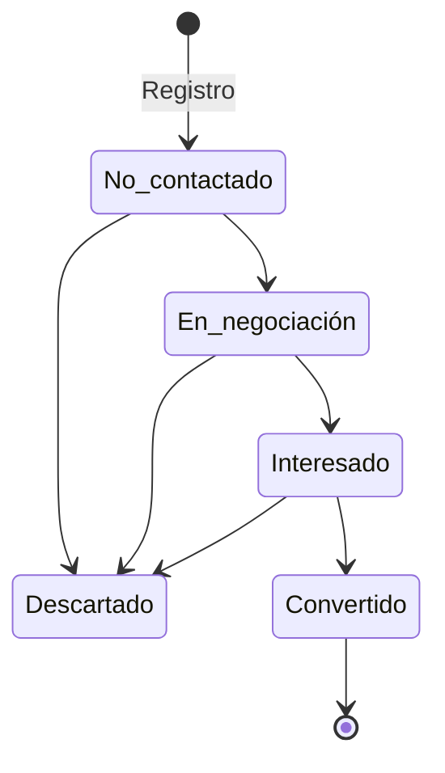

# Prospectos

## Definición

Persona o empresa en proceso de captación. No es cliente aún. Puede convertirse en [[Clientes|Cliente]] al completar el proceso de onboarding.

## Ciclo de Vida

**Etapas válidas:** `No contactado`, `En negociación`, `Interesado`, `Descartado`, `Convertido`

## Campos Clave

- `id`: Identificador único del prospecto
- `nombre`: Nombre completo
- `etapa`: Estado en el pipeline
- `producto`: Producto de interés

## Reglas de Negocio

1. Estado `Convertido` implica que el prospecto pasó a ser cliente.
2. El agente puede actualizar `etapa`, `monto` y `producto` mediante intent `ACTUALIZAR_PROSPECTO`.
3. Cuando el usuario visualiza un prospecto, el frontend envía `[SISTEMA: El usuario está visualizando el prospecto ID: ...]` al agente.

## Referencias

- [[Clientes]] — Entidad destino tras conversión
- [[Oportunidades]] — Se crean oportunidades al convertir prospectos
- [[agentes-n8n/Agente-Principal]] — Gestiona actualizaciones via intent
