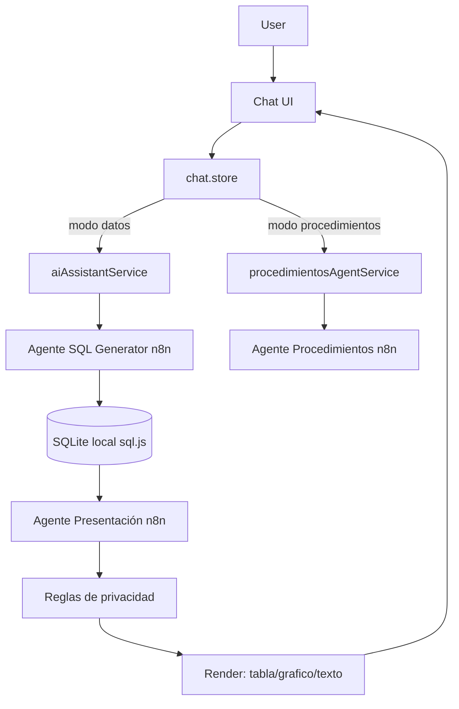

# Arquitectura AgentCRM

## Visión General

CRM conversacional bancario. El usuario pregunta en lenguaje natural; el sistema genera SQL, lo ejecuta en una base de datos **local en el navegador** (sql.js), y un segundo agente decide cómo presentar el resultado (tabla, gráfico, texto).

> [!info]
> Existe además un flujo de **escritura** (crear/actualizar prospectos y ofertas) vía [[../agentes-n8n/Agente-Prospectos-Oportunidades]], separado del chat de consulta.

## Capas

| Capa | Carpeta | Descripción |
|------|---------|-------------|
| UI Components | `src/components/` | Componentes React por dominio |
| State | `src/stores/` | Zustand stores |
| Services | `src/services/` | HTTP, Webhook, PDF |
| Config | `src/config/` | Configuración centralizada |
| Types | `src/types/` | Interfaces TypeScript |
| Utils | `src/utils/` | Funciones puras |
| Hooks | `src/hooks/` | Custom hooks React |

## Dominios de Componentes

- `chat/` — Interfaz conversacional principal
- `clientes/` — Tabla y modal de clientes
- `prospectos/` — Gestión de prospectos
- `oportunidades/` — Pipeline con sidebar de chat
- `cotizador/` — Generador de cotizaciones
- `tareas/` — Agenda y cronograma
- `charts/` — Visualizaciones (Bar, Line, Pie, Dynamic)
- `tables/` — DataTable genérico
- `forms/` — DynamicForm
- `layout/` — AppLayout, Sidebar, Header
- `common/` — Button, Card, Input, Badge, Avatar, Spinner, IconButton

## Flujo de Datos del Chat

Ver detalle en [[Chat]] y [[Servicios#aiassistantservice]].

## Referencias

- [[Servicios]]
- [[Stores]]
- [[Base-de-Datos-SQL]]
- [[Chat]]
- [[../agentes-n8n/Agente-Principal]]
