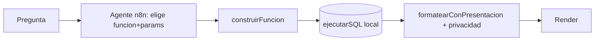

# Catálogo de Funciones del Agente

`src/services/agentFunctions.ts`

## Objetivo

Eliminar el SQL libre y el reenvío de filas al LLM. El **cerebro** (agente n8n) solo elige una función y sus parámetros: `{ funcion, params }`. El código construye el SQL exacto, lo ejecuta en [[Base-de-Datos-SQL]] y lo formatea con la pista de presentación de la función — **sin llamar al [[../agentes-n8n/Agente-Presentacion|Agente de Presentación]]**.

## Beneficios

- Salida del LLM ~20 tokens (nombre + params) en vez de SQL largo.
- **0 tokens** en presentación (la decide la función).
- Precisión: params validados/whitelist, sin SQL inválido ni inyección.
- 1 sola llamada LLM (antes 2).

## Funciones disponibles

| Función | Params | Presentación |
|---------|--------|--------------|
| `listadoClientes` | soloActivos, limite | tabla |
| `detalleCliente` | ide* | tabla |
| `topClientesPorSaldo` | producto* (tdc/cheques/tpv/creditos), limite | tabla |
| `variacionesRelevantes` | tipo (ingreso/egreso/ambos), limite | tabla |
| `listadoProspectos` | etapa, familia, limite | tabla |
| `listadoOportunidades` | etapa, familia, limite | tabla |
| `conteoPorEtapa` | entidad (oportunidades/prospectos) | gráfico pie |
| `montoPorFamilia` | — | gráfico bar |
| `clientesMasRentables` | limite | **kpi** (tarjetas + tabla + insight) |
| `crossSellGap` | tiene*, noTiene*, limite | tabla + KPIs + insight |
| `contratosPorVencer` | producto (tdc/credito/seguros), dias, limite | tabla + KPIs + insight |
| `resumen360Cliente` | ide* | **kpi** + insight |

\* requerido. Todos los `limite` están acotados (clamp) y los enums en whitelist.

## Analítica de banca (nuevas)

- **`clientesMasRentables`** — ranking por **rentabilidad anual estimada** con desglose de margen por producto. Responde "¿quién es mi cliente más rentable y por qué?".
- **`crossSellGap`** — clientes que tienen un producto pero NO otro (ej. *TDC sin nómina*), con monto y vencimiento próximo. Venta cruzada.
- **`contratosPorVencer`** — TDC/créditos/seguros que vencen en N días, con monto en riesgo y días restantes.
- **`resumen360Cliente`** — foto 360° de rentabilidad de un cliente.

### Fórmula de rentabilidad (margen anual)
`TDC lineaUso·0.30 + crédito saldoActual·0.18 + cheques saldoLinea·0.04 + TPV facturación·0.012 + seguros prima·0.20 + nómina monto·0.02` (solo activos). Ver `SQL_RENTABILIDAD` en `agentFunctions.ts`.

## KPIs e insight (sin fuga de datos)

`PresentacionHint` ahora admite:
- `kpis: { etiqueta, columna, agregado(sum|avg|first|count|max|min), formato(moneda|numero|porcentaje|texto) }[]` — el frontend **calcula** las tarjetas a partir del resultado SQL (0 tokens, el agente solo declara qué columna resumir).
- `insight: string` — texto markdown con el "porqué"; lo escribe el agente sin ver datos.
- `formato: 'kpi'` — render de tarjetas + tabla de desglose + insight.

## API del módulo

- `construirFuncion(nombre, params)` → `{ sql, presentacion } | { error }`
- `existeFuncion(nombre)` → boolean
- `descripcionCatalogoParaPrompt()` → texto del catálogo para el pre-prompt n8n

## Integración

En [[Servicios#aiassistantservice]] (`procesarPregunta`): si la respuesta del agente trae `funcion` válida → ruta de catálogo. Si no, **fallback** a la ruta de SQL libre + Agente de Presentación (compatibilidad).

## Cómo agregar una función

Añadir una entrada a `CATALOGO` con `nombre`, `descripcion`, `params` y `construir(params)` que devuelva `{ sql, presentacion }`. Actualizar el pre-prompt de n8n con [[../agentes-n8n/Pre-Prompt-Cerebro]].

## Referencias

- [[../agentes-n8n/Pre-Prompt-Cerebro]] — prompt del agente
- [[../agentes-n8n/Agente-SQL-Generator]]
- [[Servicios#aiassistantservice]]
- [[../negocio/Privacidad-Datos]]
