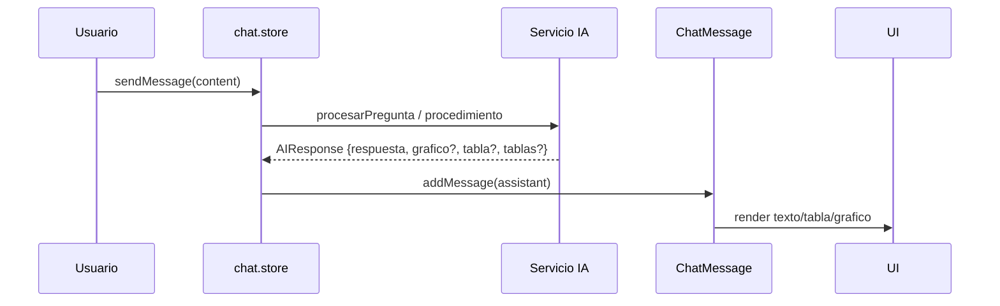

# Sistema de Chat

`src/components/chat/` + [[Stores#chat-store]].

## Componentes

| Componente | Rol |
|------------|-----|
| `ChatContainer` | Orquestador principal |
| `ChatHeader` | Encabezado, selector de modo |
| `MessageList` | Lista de mensajes |
| `ChatMessage` | Renderiza un mensaje (texto/tabla/gráfico/multi) |
| `ChatInput` | Entrada de texto |
| `TypingIndicator` | Indicador de "escribiendo" |
| `WelcomeMessage` | Mensaje inicial + sugerencias |
| `PromptLibrary` | Biblioteca de prompts predefinidos |
| `FilterableProductTable` | Tabla de productos filtrable |
| `OfferDetailModal` | Detalle de oferta |

## Modos (`chatMode`)

- **`datos`** → `procesarPregunta` ([[Servicios#aiassistantservice]], dual-agent SQL).
- **`procedimientos`** → `procesarPreguntaProcedimiento` ([[Servicios#procedimientosagentservice]]).

## Flujo de mensaje

El mensaje del asistente lleva `grafico`, `tabla` y/o `tablas` adjuntos. El store también guarda `ultimoGrafico` / `ultimaTabla` para compatibilidad.

## Referencias

- [[Stores#chat-store]]
- [[Servicios]]
- [[../agentes-n8n/Agente-Principal]]
