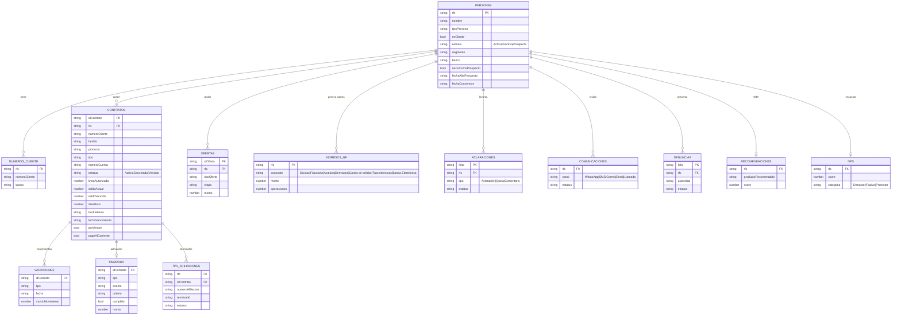

# Ciclo de Vida — Modelo de Datos (ERD)

Tablas normalizadas del ciclo de vida 360°. Generadas en `src/data/ciclo-seed/index.ts` (determinista por RFC) y cruzadas con el seed de Ofertas.

## ERD

## Reglas de integridad

- **PERSONAS** unifica cliente y prospecto (`esCliente`). Un **prospecto** NO tiene: `NUMEROS_CLIENTE`, `CONTRATOS`, `VARIACIONES`, `TIMBRADO`, `TPV_AFILIACIONES`, `INGRESOS_NF`, `NPS`. Sí puede tener: `OFERTAS`, `COMUNICACIONES`, `ACLARACIONES`, `RECOMENDACIONES`.
- `VARIACIONES`/`TIMBRADO`/`TPV_AFILIACIONES` cuelgan de `CONTRATOS` (FK `idContrato`).
- `OFERTAS` proviene de [[Ofertas-Modulo|ofertas-seed]] (FK `RFC`).

## API

- `getCiclo360(rfc)` → ensambla la vista (todas las cruzas).
- `listPersonas()` → catálogo para el selector cliente/prospecto.
- Tablas exportadas: `PERSONAS, NUMEROS_CLIENTE, CONTRATOS, VARIACIONES, INGRESOS_NF, TIMBRADO, ACLARACIONES, COMUNICACIONES, DENUNCIAS, TPV, RECOMENDACIONES, NPS_TBL`.

## Privacidad: identidad ≠ finanzas

> [!danger] Regla
> En **ninguna pantalla** se muestran juntas la **identidad** del cliente (nombre, RFC, contacto) y sus **finanzas**. Aplica también a prospectos.

- `InfoClienteView` — SOLO identidad/contacto + números de cliente. Sin finanzas.
- `Ciclo360View` — finanzas/actividad SIN nombre ni RFC (encabezado neutro: estatus, perfil, NPS, línea de vida).

## Vistas (implementadas)

`src/components/ciclo/`:
- **`CicloVidaContainer`** — módulo de barra lateral. **Vista 1: tabla** (como Ofertas) de clientes/prospectos (Nombre, RFC, Tipo, Estatus, Segmento — sin finanzas) con buscador, filtro (todos/clientes/prospectos) y paginación + botón **Ver detalle**. **Vista 2: detalle** con 2 secciones separadas en nav: **Info del cliente** (`InfoClienteView`) y **Ciclo de vida** (`Ciclo360View`).
- **`Ciclo360View`** — renderizador 360° reutilizable (props `rfc`) por **pestañas**: Resumen (KPIs + donut distribución + barras de movimientos + NBA), Productos (tarjetas con uso de línea), Saldos y mora (KPIs + buckets + tabla), Líneas por vencer, Movimientos (timbrado + variaciones), Ingresos NF (+TPV), Ofertas (enlazan al módulo Ofertas), Comunicaciones (filtro por canal + ver contenido), Aclaraciones (filtros tipo/estatus + ver detalle), Denuncias. Prospecto solo ve Resumen/Ofertas/Comunicaciones/Aclaraciones.
- **`InfoClienteView`** — sección de identidad.

## Navegación entre módulos

`src/stores/nav.store.ts` (`useNavStore`): `view`, `setView`, `abrirOferta(idOferta)`. App.tsx y Sidebar usan el store. Desde la pestaña **Ofertas** del ciclo, hacer clic en una oferta llama `abrirOferta` → cambia a módulo **Ofertas** y abre su detalle (mismo `OfertaDetalle`).

## Campos de contenido (seed)

`Comunicacion.contenido` y `AclaracionQueja.detalle` añadidos para "consultar el contenido".

Doble entrada:
1. Barra lateral **Ciclo de vida** → tabla → detalle (2 secciones).
2. Detalle de oferta → sección **Ciclo de vida** → `Ciclo360View` filtrado por `RFC` (la identidad va en la pestaña "Info del cliente" de la oferta).

## Marcas

Sin marcas de banco en ninguna pantalla. Sidebar muestra "CRM" y el toggle de tema es neutro ("Tema claro/oscuro"). Datos: `banco` neutralizado a "Banco A/B" y no se muestra en las vistas del ciclo.

## Referencias

- [[../negocio/Ciclo-de-Vida-360]]
- [[Ofertas-Modulo]]
