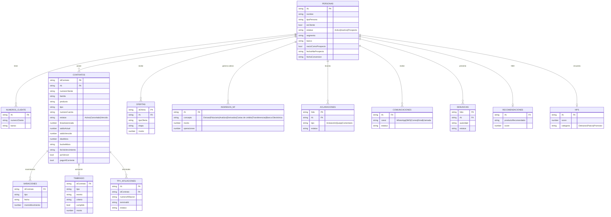

# Ciclo de Vida — Modelo de Datos (ERD)

Tablas normalizadas del ciclo de vida 360°. Generadas en `src/data/ciclo-seed/index.ts` (determinista por RFC) y cruzadas con el seed de Ofertas.

## ERD

## Reglas de integridad

- **PERSONAS** unifica cliente y prospecto (`esCliente`). Un **prospecto** NO tiene: `NUMEROS_CLIENTE`, `CONTRATOS`, `VARIACIONES`, `TIMBRADO`, `TPV_AFILIACIONES`, `INGRESOS_NF`, `NPS`. Sí puede tener: `OFERTAS`, `COMUNICACIONES`, `ACLARACIONES`, `RECOMENDACIONES`.
- `VARIACIONES`/`TIMBRADO`/`TPV_AFILIACIONES` cuelgan de `CONTRATOS` (FK `idContrato`).
- `OFERTAS` proviene de [[Ofertas-Modulo|ofertas-seed]] (FK `RFC`).

## API

- `getCiclo360(rfc)` → ensambla la vista (todas las cruzas).
- `listPersonas()` → catálogo para el selector cliente/prospecto.
- Tablas exportadas: `PERSONAS, NUMEROS_CLIENTE, CONTRATOS, VARIACIONES, INGRESOS_NF, TIMBRADO, ACLARACIONES, COMUNICACIONES, DENUNCIAS, TPV, RECOMENDACIONES, NPS_TBL`.

## Vistas (implementadas)

`src/components/ciclo/`:
- **`Ciclo360View`** — renderizador 360° reutilizable (props `rfc`); consume `getCiclo360`. Prospecto oculta bloques de productos.
- **`CicloVidaContainer`** — módulo de barra lateral: lista de clientes/prospectos carterizados (buscador + filtro todos/clientes/prospectos) + detalle 360° del seleccionado. Nav: `ciclo` (App.tsx + Sidebar).

Doble entrada:
1. Barra lateral **Ciclo de vida** → revisar todos los clientes uno por uno.
2. Detalle de oferta → sección **Ciclo de vida** → `Ciclo360View` filtrado por `RFC` de la oferta (cruce con la tabla de ofertas).

## Referencias

- [[../negocio/Ciclo-de-Vida-360]]
- [[Ofertas-Modulo]]
